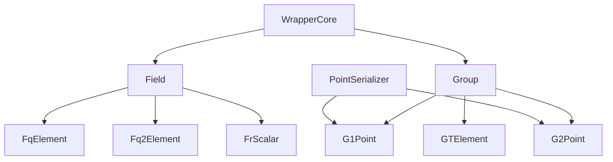

# libBLS Algebra Backends

This document explains how the algebra layer in **libBLS** is organized and how to add a new backend. The goal is to keep higher‑level modules (BLS, DKG, Threshold Encryption) **backend‑agnostic** while allowing a concrete library (mcl, libff, or others) to provide the actual elliptic curve math.

---

## Folder Structure

```
backends/
│
├─ interface/                    # Backend‑agnostic wrappers and contracts
│  ├─ field/
│  │  ├─ Field.hpp               # Base interface for field elements
│  │  ├─ FqElement.hpp           # Base field element wrapper
│  │  ├─ Fq2Element.hpp          # Quadratic extension field wrapper
│  │  └─ FrScalar.hpp            # Scalar field wrapper
│  │
│  ├─ group/
│  │  ├─ Group.hpp               # Base interface for group elements
│  │  ├─ G1Point.hpp             # G1 wrapper
│  │  ├─ G2Point.hpp             # G2 wrapper
│  │  └─ GTElement.hpp           # Pairing target group wrapper
│  │
│  ├─ PointSerializer.hpp        # Deterministic point iteration and serde helpers
│  ├─ Functions.hpp              # High‑level algebra functions (pairing, Lagrange)
│  ├─ init.hpp                   # Curve initialization entry point
│  └─ WrapperCore.hpp            # Shared wrapper utilities
│
├─ mcl/                          # Concrete backend implementation: mcl
│  ├─ field/ {FqElement.cpp, Fq2Element.cpp, FrScalar.cpp}
│  ├─ group/ {G1Point.cpp, G2Point.cpp, GTElement.cpp}
|  ...
...
```

---

## Design Overview



<br>

* **Wrappers in `interface/`**

  * Define the canonical API used by higher‑level modules.
  * Types: `FqElement`, `Fq2Element`, `FrScalar`, `G1Point`, `G2Point`, `GTElement`.
  * Provide common operations, serialization, and `validate()` (on‑curve and subgroup checks).
  * `PointSerializer` ensures deterministic point traversal and encoding.

* **Concrete backends (`mcl/`, `libff/`, …)**

  * Implement the wrapper interfaces for a specific library.
  * Provide optimized pairing and interpolation in `Functions.cpp`.
  * Initialize curve parameters in `init.cpp`.

* **Backend selection**

  * Chosen at compile time:

    * `-DUSE_MCL` (default)
    * `-DUSE_LIBFF`
  * A new backend only needs its own folder mirroring the structure above.

---

## Serialization and Deserialization Rules

* **Defaults provided** for `FrScalar` and `FqElement`:

  * `toStringDefault`, `fromStringDefault`, `toBytesDefault`, `fromBytesDefault`.
  * These guarantee a consistent format across backends.
* **Backend policy**:

  * If the backend has no faster native option, call the default helpers inside `toString`, `fromString`, `toBytes`, `fromBytes`.
  * If the backend can implement a faster or zero‑copy method, implement it directly in these functions. The public behavior must remain compatible with the defaults.
* All string serialization requires an explicit base argument (for example `DEC` or `HEXA`).

---

## Validation Contract

* Wrappers expose `validate()` for points and field elements.
* `validate()` performs the standard checks in a single call.
* When constructing points from raw coordinates, the caller must call `validate()` before use.

---

## Adding a New Backend

1. **Create a folder** under `backends/` (for example `newlib/`).
2. **Implement field wrappers** in `field/`:

   * `FqElement.cpp`, `Fq2Element.cpp`, `FrScalar.cpp`.
   * Provide arithmetic, comparison, serde (use defaults if needed), and conversions.
3. **Implement group wrappers** in `group/`:

   * `G1Point.cpp`, `G2Point.cpp`, `GTElement.cpp`.
   * Provide arithmetic, subgroup checks, hashing to curve if required by the library, and serde.
4. **Add algebra functions** in `Functions.cpp`:

   * Pairing, exponentiation, Lagrange interpolation, and other shared helpers.
5. **Initialize the curve** in `init.cpp`.
6. **Expose concrete types** by aliasing them in `interface/init.hpp`.
7. **Wire up CMake** from `backends/` to select your backend with a flag (for example `-DUSE_NEWLIB`), right below these lines:
    ```Cmake
    if(USE_LIBFF)
        message("Using libff backend")
        set(BACKEND_NAME "libff")                           # used as the directory name
        set(BACKEND_LIB "ff")                               # used as the library name when linking
        set(BACKEND_COMPILE_OPTIONS "")
        set(BACKEND_DEPS ${GMPXX_LIBRARY} ${GMP_LIBRARY})   # extra dependencies that may be used by the backend
        set(BACKEND_DEFINE LIBFF)
    elseif(USE_MCL)
        message("Using mcl backend")
        set(BACKEND_NAME "mcl")
        set(BACKEND_LIB "mcl")
        set(BACKEND_COMPILE_OPTIONS "MCL_USE_GMP=1")
        set(BACKEND_DEPS ${GMPXX_LIBRARY} ${GMP_LIBRARY})
        set(BACKEND_DEFINE MCL)
        # add more backends below if needed
    endif()
    ```
8. **Run the backend test** (`test/unit_tests_backend.cpp`) to ensure the new backend complies with the correct serialization / deserialization format. Run also all other unit tests to test end-to-end.
