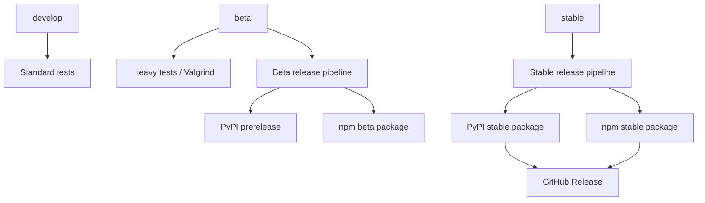
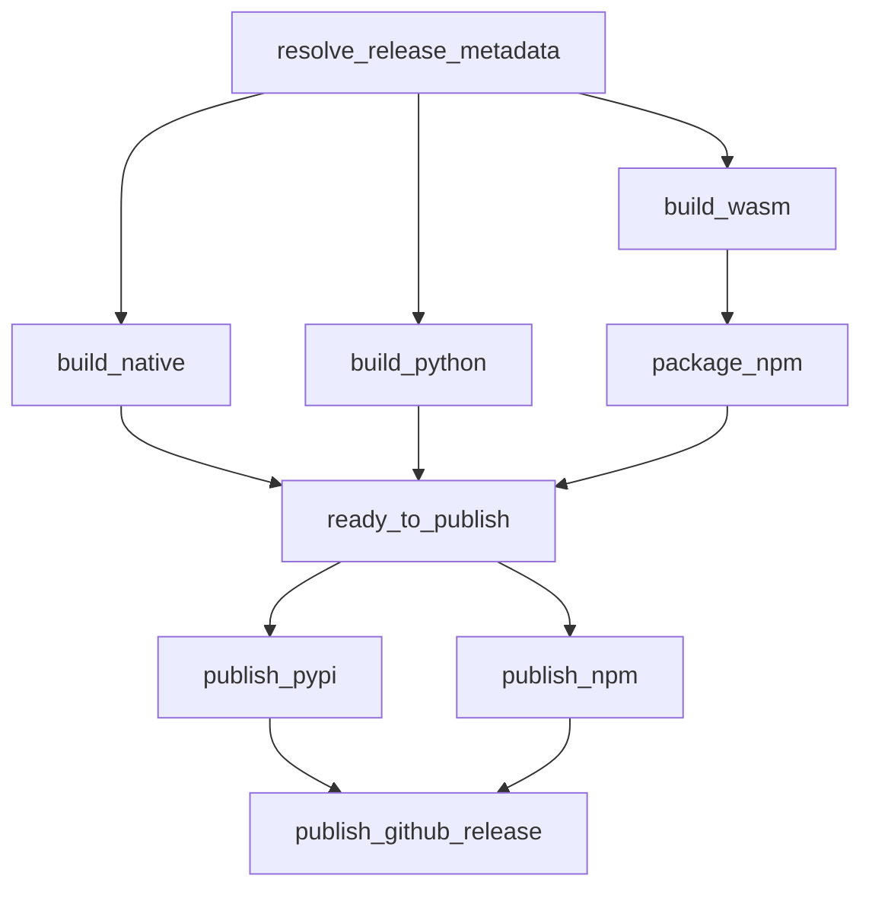

# CI and Release Architecture

This document describes the continuous integration (CI) workflows, release model, versioning rules, and publishing pipelines for libBLS.

libBLS follows the standard branch and release architecture used across SKALE protocol repositories (such as `skaled` and `consensus`).


## 1. Branch-Based CI and Release Flow

The automated workflows follow a 3-tier promotion lifecycle: `develop` → `beta` → `stable`.

* **`develop`**
  * Runs standard compilation, unit tests, and backend tests on pull requests and pushes.
  * Generates code coverage reports.
  * Does not publish any packages.

* **`beta`**
  * Runs extended QA and heavier validation (`heavy_tests.yml`), including Valgrind memory checks and Emscripten builds.
  * Builds and publishes beta / pre-release versions of Python and npm packages.

* **`stable`**
  * Executes the full release pipeline.
  * Publishes stable Python wheels to PyPI and WASM packages to npm.
  * Creates the official GitHub Release with native release binaries attached.



## 2. Release Workflow Pipeline

The release pipeline (`publish.yml`) is divided into distinct, decoupled stages: metadata resolution, isolated artifact builds, packaging validation, and conditional publishing.



### Key Workflow Guarantees

* **Single Metadata Resolution:** Release metadata and target package versions are computed once at the start of the run and shared across all downstream jobs.
* **Build / Publish Separation:** Build jobs only compile and test artifacts; they never publish directly.
* **Publish Gate (`ready_to_publish`):** All required artifacts (native binaries, Python wheels, npm packages) must build and pass validation before publishing begins.
* **Parallel Publishing:** PyPI and npm package publishing run concurrently once the gate passes.
* **GitHub Release Gate:** Stable GitHub Releases are created only after PyPI and npm publishing jobs succeed.
* **Idempotence & Checksum Validation:** Existing remote package versions are checked against local artifact checksums. If identical, the step succeeds idempotently; if versions match but checksums differ, the release fails immediately.
* **Tag Safety:** Git tags are validated to ensure existing stable tags are never silently moved or overwritten.
* **Dry-Run Capability:** The workflow supports manual dispatch with `publish=false` to test the entire build and packaging pipeline without publishing.


## 3. Versioning and Release Types

[VERSION.txt](VERSION.txt) is the single source of truth for all versioning across the project.

### Core Principles

1. **All 3 Release Types Share the Same Base Version:**  
   GitHub Releases (native binaries/tags), PyPI (Python wheels), and npm (WASM package) all derive their versions directly from the same base version in `VERSION.txt`.
2. **Merges into `beta` Do Not Require a Version Bump:**  
   `VERSION.txt` does not need to be updated on every merge into `beta`. Instead, beta releases automatically append an incrementing counter (`0.2.0rc0`, `0.2.0rc1`, ... on PyPI; `0.2.0-beta.0`, `0.2.0-beta.1`, ... on npm) based on the current `VERSION.txt` value.
3. **Merges into `stable` Require a Version Increase:**  
   Merging into `stable` produces the final, non-prerelease artifacts. The version in `VERSION.txt` must be higher than the previous release and must not already exist as a Git tag.

```text
VERSION.txt (e.g. 0.2.0)
          ↓
┌─────────────────────────────────────────────────────────────┐
│                 Single Base Version (0.2.0)                 │
└─────────────────────────────────────────────────────────────┘
          ↓                                     ↓
  [Beta Promotion]                      [Stable Promotion]
  - No version bump required            - Requires version increase in VERSION.txt
  - Auto-increments beta counter        - Publishes exact base version
          ↓                                     ↓
┌───────────────────────────────┐     ┌───────────────────────────────┐
│ PyPI:   0.2.0rc0, 0.2.0rc1... │     │ PyPI:   0.2.0                 │
│ npm:    0.2.0-beta.0, -beta.1 │     │ npm:    0.2.0                 │
│ GitHub: (prerelease)          │     │ GitHub: 0.2.0 tag + Release   │
└───────────────────────────────┘     └───────────────────────────────┘
```

### Published Version Summary

For example, with `VERSION.txt = 0.2.0`:

| Release Target | Published Version | Notes |
| --- | --- | --- |
| **Stable Git tag / GitHub Release** | `0.2.0` | Uses `VERSION.txt` directly |
| **Stable PyPI** | `0.2.0` | Same stable base version |
| **Stable npm** | `0.2.0` | Same stable base version |
| **Beta PyPI** | `0.2.0rc0`, `0.2.0rc1`, ... | Auto-incremented counter (PEP 440) |
| **Beta npm** | `0.2.0-beta.0`, `0.2.0-beta.1`, ... | Auto-incremented counter (SemVer) |
