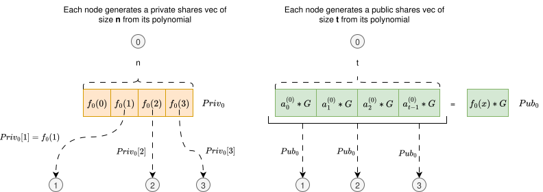
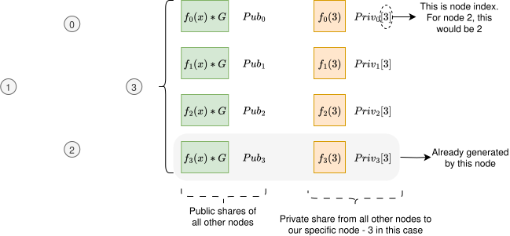
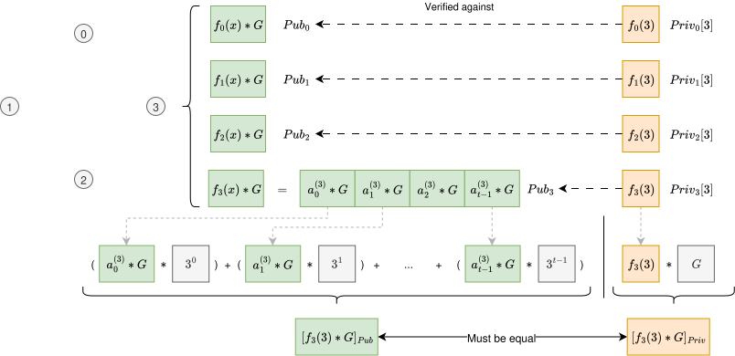
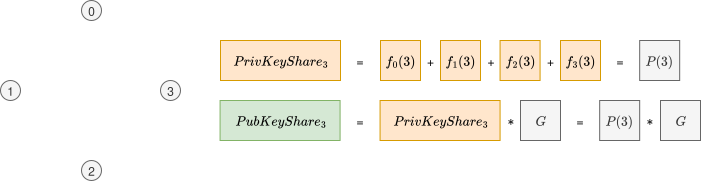

# Distributed Key Generation (DKG)

**Distributed Key Generation (DKG)** is a cryptographic protocol that enables a group of `n` participants to jointly generate a public key and associated private key shares, such that no single participant learns the complete private key. The protocol is designed for use in threshold cryptographic schemes, where any subset of at least `t` participants (with `t ≤ n`) can jointly perform cryptographic operations, while smaller subsets learn nothing about the private key.

DKG ensures the correct and verifiable distribution of secret shares without relying on a trusted dealer. The protocol proceeds in multiple stages. This document describes all steps involved in this key distribution process, and also provides some background on why things work how they work.

Throughout this document there will be diagrams. Public key-related data is represented in green. Private key-related data is represented in orange.
Circles with numbers inside depict nodes and their respective index.

---

# Step 1: Local Polynomial Generation

Each participant `i` in {1, ..., n} independently generates a random secret polynomial `f_i(x)` over a finite field `F`, of degree `t - 1`. The diagram below shows an example with 4 nodes, which we will use throughout the rest of this document.


<br>
<br>

The coefficients of each polynomial are chosen uniformly at random.

This polynomial serves two purposes:
- It defines the shares that participant `i` will distribute to all other participants.
- It enables the derivation of a **public commitment vector**, which will be used for share verification.

Besides the computation of the polynomial, each node also computes its public key `Pub_i` as `f_i(x) * G`. For simplicity, we only show this computation for node 0 in the diagram above, but all other nodes also compute it using their own polynomials.

### Aggregated Global Polynomial

The overall system secret is defined implicitly by the sum of all individual polynomials:


This results in a global polynomial `P(x)` of degree at most `t - 1`, which is never explicitly constructed or known in its entirety by any single party. However, each participant will hold one evaluation \( P(j) \), corresponding to their private share, and the public commitment to \( P(x) \) will be derived from the commitments to each \( f_i(x) \).

The common public key will later be defined as `P(0) * G`, where `G` is a **generator** of the chosen elliptic curve group.


---

# Step 2: Share Distribution and Public Commitment Broadcasting

After each participant generates its secret polynomial and public commitment vector, the next step is to exchange information with the group. This step ensures that each node contributes to the final shared secret, and allows others to verify the validity of those contributions.

#### Private share distribution

Each node `i` evaluates its polynomial `f_i(x)` at every index `j = 1 to n`. This produces a list of `n` scalar values (represented in left side of the diagram below, colored orange):

```
Priv_i = [f_i(1), f_i(2), ..., f_i(n)]
```

Then, node `i` sends `f_i(j)` **only** to node `j`. This means each node receives one value from every other node.

- Node `j` will receive: `f_1(j), f_2(j), ..., f_n(j)`

#### Public share distribution

Each node `i` will also share its public key (represented in the right side off the diagram below, colored green), computed in the previous step. This public key can be seen either as `f_i(x) * G`, or as a list of **t** items, where each index is a coefficient multiplied by `G`. They are both the same, but represented in different ways.

It is important to notice that the list representation of the public key is of size **t**, whereas the list of private shares is of size **n**.


<br>



<br>
<br>

As an example, at the end of this step, node `3` will end up with the following state:
- A public key `Pub_i` from each other node `i` (green boxes in diagram below)
- An evaluation at point `3` from the polynomial of each node `i` (orange boxes in diagram below)

<br>



<br>

---

# Step 3 - Validation

Upon having received all public and private key shares from all other nodes, each node `i` performs the validation of each (`Pub_j`, `Priv_j[i]`) pair received from node `j`.

The validation process is simple. Each node `i`:
1. Having received `f_j(x) * G` from node `j`, compute `f_j(i) * G` by substituting the `x` values in the polynomial by `i`. Notice that we only have acces to the coefficients already multiplied by `G`. not the original coefficients. And due to ECDL problem, we cannot get them from the public key received. This step is represented in the left bottom half of the diagram below, using the green boxes. Let's call the result of this operation `[f_j(i)*G]_pub` since it was computed from `Pub_j`.
2. Having received `f_j(i)` from node `j`, we compute the same end value `f_j(i) * G`. But this time we start from the private share we got from `j`, instead of using the public key. Let's call this result `[f_j(i)*G]_priv`.
3. Compare `[f_j(i)*G]_pub` with `[f_j(i)*G]_priv`. If they differ, validation does not pass. Else, it passes.

<br>



<br>

# Step 4 - Computation of PublicKey share and PrivateKey share

After having validated all data received from all nodes, each node computes its final `PrivateKeyShare` and `PublicKeyShare`:
- `PrivateKeyShare` - Sum of all `f_j(i)` received, which is the same as `P(3)`, where `P(x)` is the global polynomial (sum of all individual plynomials)
- `PublicKeyShare` - Computed as `PrivateKeyShare * G`.

<br>



<br>