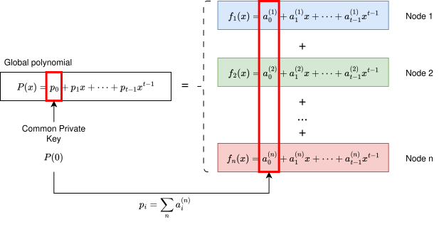
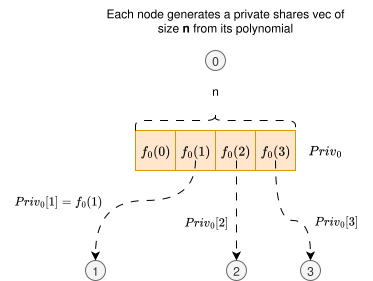
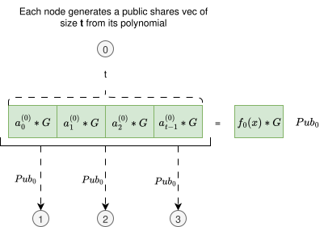
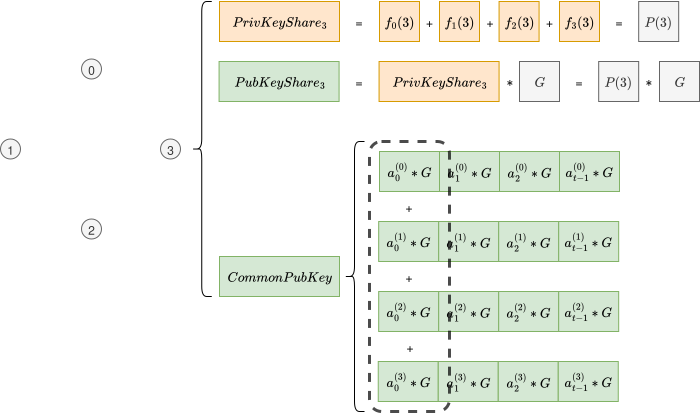

# Distributed Key Generation (DKG)

**Distributed Key Generation (DKG)** is a cryptographic protocol that allows a group of `n` participants to collaboratively generate a shared public key and corresponding private key shares, such that **no individual participant ever learns the full private key**.

DKG is designed for **threshold cryptographic schemes**, where any subset of at least `t` participants (with `t ≤ n`) can jointly perform cryptographic operations, while smaller subsets learn nothing about the secret.

Unlike schemes that rely on a trusted dealer to distribute key shares, DKG ensures that the generation and distribution of the secret is:

- **Decentralized** — there is no central authority.
- **Verifiable** — all parties can validate the correctness of the shares.
- **Secure** — adversarial participants cannot compromise the secret unless they reach the threshold.

This document describes all stages of the DKG protocol, with justifications and background provided throughout.

To aid comprehension, diagrams are used:

- Elements **in green** represent **public key-related data**.
- Elements **in orange** represent **private key-related data**.
- **Circles with numbers** depict participating nodes and their indices.


---

# Step 1: Local Polynomial Generation

Each participant `i` in {1, ..., n} independently generates a random secret polynomial `f_i(x)` over a finite field `F`, of degree `t - 1`. The diagram below shows an example with 4 nodes, which we will use throughout the rest of this document.


<br>
<br>

The coefficients of each polynomial are chosen uniformly at random.

This polynomial serves two purposes:
- It defines the shares that participant `i` will distribute to all other participants.
- It enables the derivation of a **public commitment vector**, which will be used for share verification.

Besides the computation of the polynomial, each node also computes its public commitment vector `Pub_i` as `f_i(x) * G`, where `G` is the **generator** of the chosen elliptic curve group. For simplicity, we only show this computation for node 0 in the diagram above, but all other nodes also compute it using their own polynomials.

Although we represent the commitment vector as `f_i(x) * G` in the diagram above for simplicity, it is actually stored as a vector of each coefficient:

<br>

<br>

Thus, each index `i` of this public commitment vector will be `a_i * G`.

### Aggregated Global Polynomial

The overall system secret is defined implicitly by the sum of all individual polynomials:


This results in a global polynomial `P(x)` of degree at most `t - 1`, which is never explicitly constructed or known in its entirety by any single party. However, each participant will end up holding one evaluation \( P(j) \), corresponding to their private share, and the public commitment to \( P(x) \) will be derived from the commitments to each \( f_i(x) \).

The `CommonPrivateKey` of the system (the same for entrie system) is set as `P(0)`, i.e, the **constant term of the global polynomial**
The `CommonPublicKey` will be defined as `P(0) * G`. I.e, `CommonPrivateKey * G`. 

Both will only be computed at the final step as we will se later on.


<br>
<br>


---

# Step 2: Share Distribution and Public Commitment Broadcasting

After each participant generates its secret polynomial and public commitment vector, the next step is to exchange information with the group. This step ensures that each node contributes to the final shared secret, and allows others to verify the validity of those contributions.

#### Private share distribution

Each node `i` evaluates its polynomial `f_i(x)` at every index `j = 1 to n`. This produces a list of `n` scalar values:

```
Priv_i = [f_i(1), f_i(2), ..., f_i(n)]
```

Then, node `i` sends `f_i(j)` **only** to node `j`. This means each node receives one value from every other node.

- Node `j` will receive: `f_1(j), f_2(j), ..., f_n(j)`

This process is illustrated below:

<br>

<br>
<br>

#### Public commitment vector distribution

Each node `i` will also share its **public commitment vector**, computed in **Step 1**. As explained, this public key can be seen either as `f_i(x) * G`, or as a list of **t** items, where each index is a coefficient multiplied by `G`. Both , but represented in different ways.

It is important to notice that the list representation of the public key is of size **t**, whereas the list of private shares is of size **n**.
The diagram below shows this process:

<br>

<br>
<br>

#### Final state

As an example, at the end of steps 1 and 2, node `3` will end up with the following state:
- A **public commitment vector** `Pub_i` from each other node `i` (green boxes in diagram below)
- An evaluation at point `3` from the polynomial of each node `i` (orange boxes in diagram below)

<br>

<br>

---

# Step 3 - Validation

Upon having received all public and private key shares from all other nodes, each node `i` performs the validation of each (`Pub_j`, `Priv_j[i]`) pair received from node `j`.

The validation process is simple. Each node `i`:
1. Having received `f_j(x) * G` from node `j`, compute `f_j(i) * G` by substituting the `x` values in the polynomial by `i`. Notice that we only have acces to the coefficients already multiplied by `G`, not the original coefficients. And due to ECDL problem, we cannot get `a` from `a * G`. This step is represented in the left bottom half of the diagram below, using the green boxes. Let's call the result of this operation `[f_j(i)*G]_pub` since it was computed from `Pub_j`.
2. Having received `f_j(i)` from node `j`, we compute the same end value `f_j(i) * G`. But this time we start from the private share we got from `j`, instead of using the public key. Let's call this result `[f_j(i)*G]_priv`.
3. Compare `[f_j(i)*G]_pub` with `[f_j(i)*G]_priv`. If they differ, validation does not pass. Else, it passes.

<br>

<br>

---

# Step 4 - Computation of all needed keys

After having validated all data received from all nodes, each node computes the following keys:
- `PrivateKeyShare` - Sum of all `f_j(i)` received, which is the same as `P(3)`, where `P(x)` is the global polynomial (sum of all individual plynomials). Meaning each node will end up with the evaluation of `P(x)` for its node index. This will come handy when we collect several other points from other nodes in order to reconstruct the original polynomial from its points. This key is **unique to this node**.
- `PublicKeyShare` - Computed as `PrivateKeyShare * G`. Will be **unique to this node**.
- `CommonPublicKey` - Computed as the sum of all indices 0 from all commitment vectors - `Pub_i` - received. This results in the same value as `P(0) * G` without having to know `P(0)`.

Below we show an example of final state for node 3:
<br>

<br>
<br>

After **Step 4**, the system is ready to start using either BLS signatures, or [Threshold Encryption](../threshold-encryption/1-threshold-encryption.md).