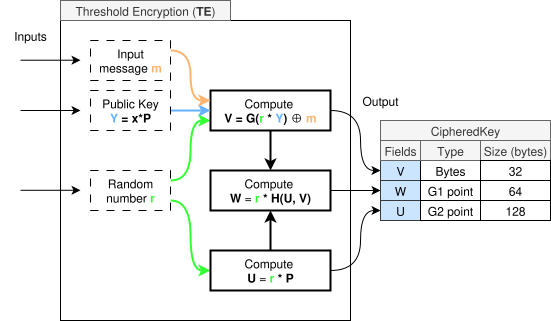
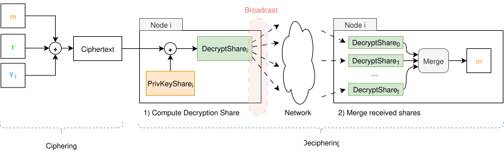
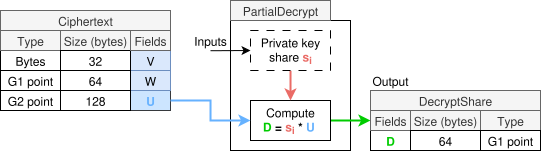
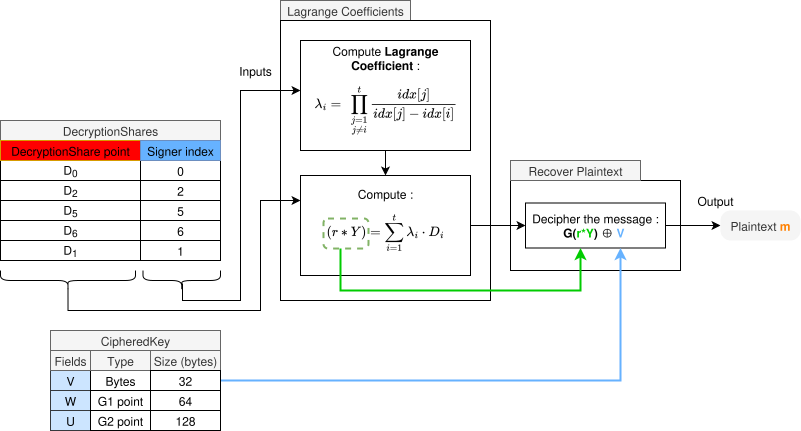

# Threshold Encryption

Threshold encryption (TE) is a form of public key encryption in which the decryption key is distributed across multiple parties. A message can only be decrypted if a threshold number of parties collaborate. This technique ensures both **confidentiality** and **fault tolerance** in cryptographic systems, especially in distributed environments.

This document starts by explaining the **encryption** phase of the threshold encryption process, focusing on the generation of a `CipheredKey` object from a message, a public key, and a random scalar.

Then we explain the **decryption** process in order to retrieve the original plaintext.

Finally we explain how **validation** happens in the different stages of the encryption-decryption process such that any node can validate the correctness of the data it is using for the threshold encryption process.

> **Note:** This process assumes the [DKG](../distributed-key-generation/dkg.md) procedure was already executed, and each node is already in posession of its `PrivateKeyShare` as well as the global `CommonPublicKey`.

---

# 1. Encryption

Below is a visual representation of the generic encryption process, which will be used as reference in the `step-by-step breakdown` section:



<br>

The process takes `3` inputs:
- `m` - Plaintext message. Must be exactly `32` bytes. For our use case, this message will be an `AES256` key, which is exactly `32` bytes. We explain why we use an `AES256` key in [te-full-flow.md](./2-te-full-flow.md).
- `Y = x⋅P` - A public key (G2 point), generated from the respective private key share `x`, where `P` is a known generator.
- `r`: A random scalar (ephemeral secret).

And it generates a single output - A `CipheredKey` struct that is always `224` bytes long, and includes `V`, `W` and `U` fields.

---

## Step-by-Step Breakdown

### 1. Compute `V`

We start by computing:

```
V = G(r ⋅ Y) ⊕ m
```

- `r ⋅ Y` is a scalar multiplication over the elliptic curve, producing a secret point using the common public key `Y` and the secret scalar `r`.
- `G(⋅)` is a cryptographic hash function that maps the elliptic curve point to a fixed-length byte array.
- `⊕ m` denotes a bitwise XOR between the derived key and the plaintext message `m`.

The result `V` is 32 bytes and constitutes the encrypted (masked) version of the key. `V` can only be computed or reversed if either `r` or `r * Y` is known. Without knowledge of either of them, no party can recover `m` from `V`.

The security of this construction relies on two cryptographic hardness assumptions:
1. **One-wayness of hash functions**: Given `A = G(x)`, it is computationally infeasible to recover `x` from `A`.
2. **Elliptic Curve Discrete Logarithm Problem (ECDLP)**: Given a point `A = r ⋅ Y` and the public key `Y`, it is computationally infeasible to determine the scalar `r`.

These properties ensure that even if an adversary knows `V` and `Y`, they cannot recover the plaintext `m` without the original random scalar `r`.

### 2. Compute `U`

The ephemeral public component derived from the random scalar:

```
U = r ⋅ P
```

The value `U` is essential for enabling decryption: it is used by decrypting nodes to reconstruct the shared secret via pairing-based operations. This mechanism allows the sender to transmit a masked message without revealing `r`, while still enabling the authorized parties to recover it collaboratively.

### 3. Compute `W`

A binding value used for integrity verification:

```
W = r ⋅ H(U, V)
```

Here, `H(U, V)` is a hash-to-curve function that maps the tuple `(U, V)` to a point in the elliptic curve group. The resulting `W` value acts as a cryptographic commitment, binding together the ephemeral component `U` and the encrypted key `V`.

---

## Output: `CipheredKey`

The output of the encryption process is the `CipheredKey` struct, composed of the following fields:

| Field | Type     | Size (bytes) |
|-------|----------|--------------|
| `V`   | Bytes    | 32           |
| `W`   | G1 point | 64           |
| `U`   | G2 point | 128          |

This tuple forms the encrypted representation of the message `m`. Only a valid quorum of decryptors (holding key shares) will be able to recover the original message.

---

# 2. Decryption

We've seen earlier that the ciphertext is formed via `G( r * Y) ⊕ m`. Meaning the only way to recover `m`, is to recompute `G( r * Y)`, without ever needing to know `r`. 
Recall that :
- The common public key `Y` is the same as `s * P`, where `s` is the common private key, and `P` is the generator.
- The ciphertext comes with `U = r * P`

This means that:

```
r * Y = r * (s * P) = s * (r * P) = s * U
``` 

Since we have access to `U`, we need to somehow `s`. This is what the decryption process is about - collecting enough private key shares in order to merge them into `s`. This is all done implicitely, without ever allowing any party to know `s`. That is, the decryption process results in the production of `r * Y = s * U`, without ever:
- Knowing any private key share `s_i`
- Knowing the sphemeral secret `r`
- Knowing the common private key `s`

 
The following diagram (**Diagram 2**) shows the communication process to be able to decipher the ciphertext, used as reference for the following 2 subsections:



This section will focus on the **Deciphering** part of the diagram. The ciphering part is already explained in the previous section.

## 2.1 Computing Decryption Shares

To compute `s * U`, as explained earlier, we must share **t** private key shares `s_i` encoded, so that `s_i` itself isn't shared. To do this, each node computes a **partial decryption share** (`DecryptShare` in the diagram) from the ciphertext. This share is then broadcast into the network such that each node eventually gets enough shares from all other nodes, so that they can use it to get the original plaintext.
The share computation is shown in detail in the diagram below:



The process uses 2 inputs:
- `U` field from `Ciphertext`
- `s_i` - Private key share of node `i`. Only knwon by node `i`, and never exposed.

Each node computes:
```
D = s_i ⋅ U
```

And broadcasts this value to all other nodes.

## 2.2 Merging Decryption Shares

Each node waits to receive a supermajority (t >= 2/3) of `DecryptShares` from other nodes. Once enough shares were received, each node merges them. 
This process assumes you are familiar with **Lagrange Interpolation**. If not, we informally explain it below:
- Given a set of **t** points from a polynomial P(x) of degree **t-1**, Lagrange Interpolation allows rebuilding the original polynomial (by computing its coefficients) from the points only.
- Intuitively, compute a polynomial `f_i(x)` that has the same value as `P(i)` (global polynomial) for `f_i(i)`, and has the value `0` for all other points `j`: `f_i(j) = 0, j != i`. Then, we have only to **sum** all these polynomials, to get `P(x)`. It is easy to see that only one of such polynomials will pass through each point. all others will be 0. So the final polynomial must pass through all the points.

> Here is a video that explains [lagrange interpolation](https://www.youtube.com/watch?v=bzp_q7NDdd4)

The original Lagrange Interpolation equation is:

<br>

<br>

Where `x_j - x_i` in the denominator stands for the roots - enforce the polynomial has value 0 for all other points `j`, and `P(x_i)` is multiplied to enforce `f_i(i) = P(x_i)`.

This allows constructing the original polynomial. Since we only care on rebuilding the `CommonPrivateKey`, i.e, `s = P(0)`, where `P(x)` is the global polynomial as described in [DKG](../distributed-key-generation/dkg.md), we only need to compute this point specifically. So we set `x` to 0 in the above equation, and get:

<br>

<br>

Recall that we do not have access to `P(x_i) = s_i` - this is the private key share of each node - and that our goal is to compute `r * Y`.
Since we have `D_i`, we can multiply entire equation by `U`, and endup with `D_i` without needing to know `s_i`. 
- We substituted the product operator by lambda symbol for simplicity
- We substituted `P(x_i)` with `s_i`, as they are the same.

<br>

<br>

Now we have all the values needed to compute the above equation:
- We have `D_i`
- We have the node indexes to compute the lagrange coefficient

Finally, notice that `P(0) * U` is the same as `r * y`:

<br>

<br>

Allowing us to get the wanted value to decipher the original message.
The whole process is shown by the below diagram:

<br>

<br>
<br>

Notice that for lagrange interpolation, the `x_i` and `x_j` values are the indices of the nodes (`idx[i]`) that provided the `DecryptShare`. After having computed `r * Y` from the decrypt shares (box in the middle), we recover the plaintext:
1. Compute `G( r * Y )`. Since we have `r * Y`, we only need to apply `G()` to it.
2. XOR the result from previous step with the value of `V` field from ciphertext. Recall that `V = G( r * Y ) ⊕ m`. Thus:

```
V ⊕ G(r * Y) = G( r * Y ) ⊕ G( r * Y ) ⊕ m = m
```
and we get the original plaintext.

---

# 3. Validation (soon)

---

## Next Steps

Although the threshold encryption is powerful, it is slow for large messages. So it is best to use it alongside symmetric cryptography. This allows to benefit from symmetric cryptography speed as well as threshold cryptographie's security.

This more robust process is explained in [here](./2-te-full-flow.md).

