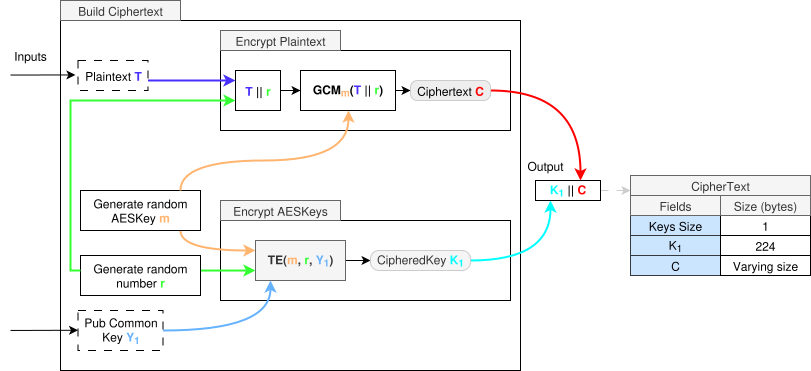
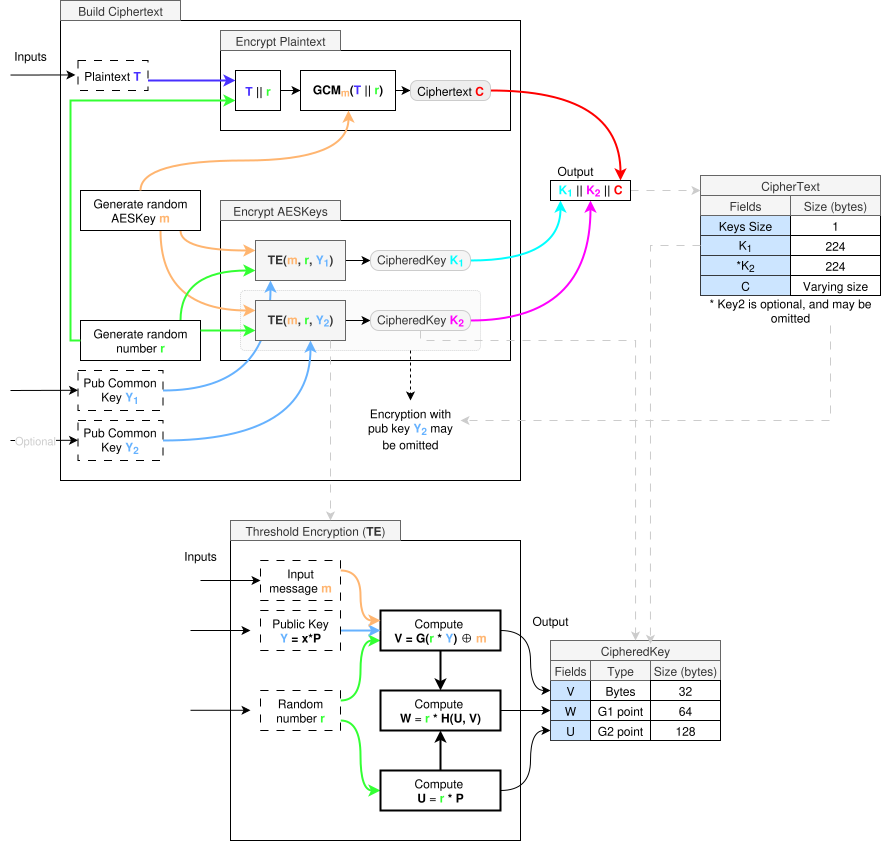
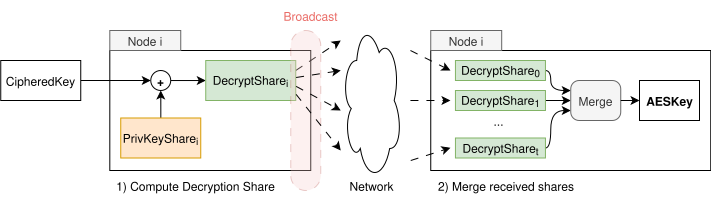
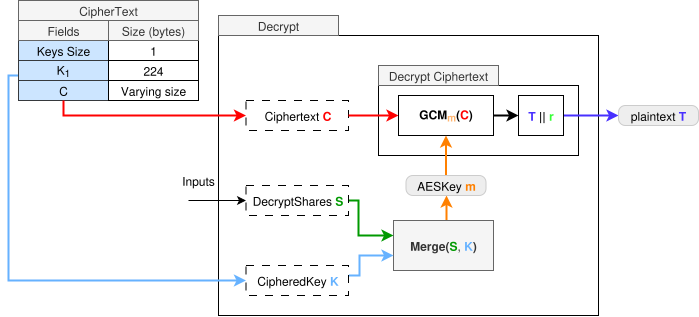
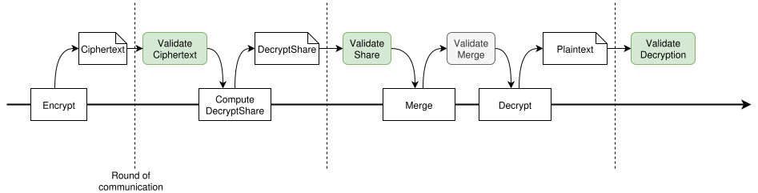

# Threshold Encryption

This document explains the complete encryption flow when using threshold encryption (TE). We first explain the base idea using a single public key, and later on we introduce the use of two public keys. The approach combines symmetric encryption for performance with threshold encryption for secure key encapsulation.

> The support for two keys is necessary for certain scenarios, such as key rotation in a committee of nodes managing the TE public key. When the set of nodes responsible for threshold decryption changes, a new public key must be generated. During the rotation period, it may be required to encrypt data under both the old and new keys to maintain continuity. This approach allows ciphertexts to be decrypted by either key set, ensuring seamless transition and backward compatibility until the rotation is fully completed.

# 1. Full Encryption Flow (Single Key)

The process is designed to:

1. Encrypt the plaintext using a randomly generated AES key (symmetric encryption).
2. Securely encrypt the AES key using threshold encryption with a TE common public key.
3. Construct a ciphertext that contains both the encrypted AES key and the encrypted payload.

---

## Overview of the Process



<br>
<br>


The diagram depicts the internal steps involved in building the ciphertext. The steps occur on the client side and assume the availability of:
- A plaintext message `T`
- A TE common public key `Y₁` (e.g., shared by a server or group of key holders)

### Inputs

- `T`: The plaintext message to be encrypted.
- `Y₁`: A public key used for threshold encryption.

---

## Encryption Steps
### 1. Generate Secrets

As a first step, two cryptographic secrets are generated:

- A **random AES key `m`**: Used for symmetric encryption of the message.
- A **random number `r`**: Used as part of the threshold encryption input to ensure semantic security.


### 2. Encrypt the Plaintext with AES

The message `T` is concatenated with the random number `r`, forming `T || r`. This is done so that, after decrypting the original key `m` through Threshold Decryption, and decrypting also `T` using `m`, we can get `r`, and use it to validate the decryption - i.e, **validate the decrypted data against the threshold encrypted key**.

This combined input is encrypted using AES in GCM mode:

``` 
C = GCM_m(T || r)
```


Where:

- `m` is the randomly generated AES key
- `GCMₘ` is the AES-GCM encryption function keyed with `m`
- `C` is the resulting ciphertext, which includes authentication data

This step is performed for efficiency, as symmetric encryption is significantly faster than asymmetric alternatives.


### 3. Encrypt the AES Key with Threshold Encryption

The AES key `m` is encrypted using threshold encryption with public key `Y₁` and random number `r`:

```
K_1 = TE(m, r, Y_1)
```


Where:

- `TE` is the threshold encryption function ([explained here](./1-threshold-encryption.md))
- `Y₁` is the network's TE common public key
- `K₁` is the encrypted AES key (also referred to as a `CipheredKey`)

Threshold encryption ensures that decryption will require access to the corresponding secret share(s), depending on the system’s threshold configuration.


### 4. Construct the Final Ciphertext

The final ciphertext consists of:

- The encrypted AES key `K₁`
- The AES-encrypted message `C`

This is serialized as:

```
Ciphertext = [Keys Size] || K₁ || C
```

The diagram reflects this with the final output structure shown on the right-hand side.

#### Example Field Sizes (for 1 Key)

| Field       | Size (bytes)     |
|-------------|------------------|
| Keys Size   | 1                |
| K₁          | 224              |
| C           | Varies           |

`Keys Size` specifies the number of keys appended. Currently we support only either `1` or `2` keys. The size of `K₁` is always fixed at 224 bytes. The size of `C` depends on the length of the plaintext and the AES-GCM overhead.


# 1.2 Full Encryption Flow (Two Keys)

The flow for 2 keys is mostly the same as when using a single key. The only difference is that we now also threshold encrypt the second key, and append it to the ciphertext.

Meaning that we reuse the same AESKey `m` as well as the random secret `r` for both Threshold Encryptions, and only change the public common key input to each of the processes.

This will still result in different `CipheredKey` struct outputs, which will then be concatenated, and be part of the final `Ciphertext`.

The following diagram shows the entire process using 2 keys, and also depicts the TE process in the bottom half, for ease of reference:




<br>

---

# 2. Decryption

Next we explain the decryption process without delving into math details. If you need to know the details [read this](./1-threshold-encryption.md).
In the threshold decryption process, each node uses its private key share to compute a **partial decryption** of the ciphertext and broadcasts this decryption share to the network. Once a supermajority (i.e., at least the threshold number of valid shares) is received, any node can combine these shares to reconstruct the original plaintext, without needing the full private key.

Since only the `CipheredKey` structure was ciphered using threshold encryption, only this needs to be merged using threshold encryption semantics.
The **result of such merging will not be the original plaintext, but the deciphered `AESKey`**

The process is shown below:


<br>
<br>

1. Each node uses its `PrivateKeyShare_i` to partial decipher the `CipheredKey`, resulting in a `DecryptShare_i` that is broadcasted to all other nodes.
2. Each node awaits for **t** decrypt shares, and merges them, resulting in the original `AESKey` used to cipher the `Ciphertext`

The **merge** process itself is detailed [here](./1-threshold-encryption.md).

Having seen the threshold encryption-decryption process to get the `AESKey`, we see next how we can use this to get the original plaintext `T` from the `Ciphertext` struct:


<br>

<br>
<br>

1. First we merge the shares against the `CipheredKey` to get the original `AESKey` (shown in bottom half of the diagram)
2. Given the `AESKey`, we run the `GCM` keyed with `m` to decipher the encrypted plaintext - the `C` field from the `Ciphertext` struct.
3. After step 2., we get `T || r`, and we extract `T` from it

Although the `r` field is not used during decryption, it is essential for validating the result: nodes use it to confirm the correctness of the recovered `AESKey`. Details of this validation process are described in the **validation section**.

---

# 3. Validation

This section explains the validation checkpoints exposed by libBLS at a high level. Mathematical details are explain [here](./1-threshold-encryption.md)

## Overview

Our threshold encryption system implements a validation framework that ensures cryptographic integrity at every stage of the encryption and decryption process. The validation stages are strategically positioned to catch errors and malicious behavior before they can propagate through the system.

<br>

<br>
<br>

The validation stages are positioned at critical transition points - usually after a communication round:

- **After Encryption**: Validates that the received ciphertext was properly formed before starting the decryption process.
- **After Share Generation**: Ensures each decryption share is authentic upon receival, thus, before merging.
- **After Share Merging**: Verifies the merged result before final decryption.
- **After Final Decryption**: Confirms end-to-end integrity of the entire process.

This creates a defense-in-depth strategy where each validation stage guards against different types of failures or attacks. By validating at these specific points, we prevent corrupted or malicious data from advancing to subsequent stages where it could otherwise have delayed the system into detecting the corrupted data only at the final stage.

## Validation Stages

### Stage 1: Ciphertext Validation

**Purpose**: Ensures that encrypted keys are mathematically well-formed and haven't been tampered with.

This validation occurs immediately after encryption and before any ciphertext used to compute a `DecryptShare`. It uses elliptic curve pairing operations to verify that the three components of the ciphertext (U, V, W) maintain the correct cryptographic relationship.

**Why it's critical**: Malformed or tampered ciphertexts could allow attackers to extract information about the underlying plaintext or disrupt the decryption process. By catching these issues early, we prevent malformed ciphertexts to proceed.

### Stage 2: Decryption Share Validation

**Purpose**: Verifies that each participant's decryption share is authentic and corresponds to their authorized key fragment.

This validation happens after each participant computes their decryption share but before shares are combined. It ensures that only authorized parties can contribute valid shares to the decryption process.

The validation checks that the decryption share was computed correctly using the participant's private key fragment and that it actually corresponds to the specific ciphertext being decrypted. Each share includes cryptographic proof that it was generated by someone possessing the correct key material.

**Why it's critical**: In threshold cryptography, the security depends on collecting shares only from legitimate participants. Accepting invalid shares could allow attackers to disrupt decryption or potentially compromise the threshold security model. This validation maintains the integrity of the participant authentication system.

### Stage 3: Combined Decryption Validation

**Purpose**: Ensures the share combination process worked correctly and produced a valid result.

This validation occurs after multiple decryption shares have been combined to reconstruct the AES encryption key. It performs two complementary checks: first validating that AES decryption succeeds, then verifying that the decrypted content matches cryptographic expectations.

**Why it's critical**: Even if individual shares are valid, errors can occur during the combination process. Mathematical errors, software bugs, or subtle tampering could result in an incorrect reconstruction. This validation ensures that the combined result is actually usable and secure.

### Stage 4: Deciphered Message Validation

**Purpose**: Provides end-to-end verification that the entire cryptographic process maintained integrity.

This is the most comprehensive validation, occurring after the complete decryption process. It reconstructs part of the original encryption process using information embedded in the decrypted message and verifies that this reconstruction produces consistent results.

The validation extracts the random secret `r` that was embedded during the original encryption, uses this secret to recompute how the AES key should have been encrypted, and verifies that this matches the actual encrypted key. This creates a cryptographic "round trip" that can only succeed if every component of the system worked correctly.

**Why it's critical**: This validation provides the highest level of assurance that the decrypted result is authentic and hasn't been compromised at any stage. This is the final **guarantee that the plaintext you receive is exactly what was originally encrypted**.

## Security Benefits

The layered validation approach provides several key security benefits:

**Early Error Detection**: Problems are caught as soon as they occur, preventing them from cascading through the system and becoming harder to diagnose or causing more severe failures.

**Attack Surface Reduction**: Each validation stage closes off different attack vectors, making it extremely difficult for malicious actors to compromise the system without detection.

**System Reliability**: The validations catch not just malicious behavior but also honest errors, hardware failures, and software bugs, making the entire system more robust and reliable.

**Auditability**: Each validation stage provides a clear checkpoint where system integrity can be verified, making it easier to audit the system's behavior and troubleshoot any issues that arise.

