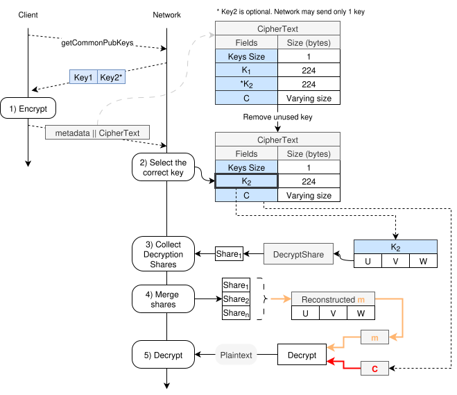
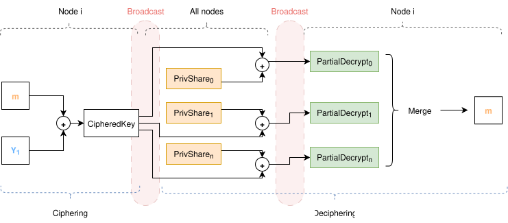

# Threshold Encryption – Full Encryption & Decryption Flow

This document describes the complete flow of the **Threshold Encryption (TE)** process, from encryption to decryption. It also covers scenarios involving **key rotation**, where a ciphertext may be encrypted using two public keys. The purpose is to enable secure handover between two node committees and ensure continuity of decryption capabilities during transitions.

This document does not cover the details of encryption / decryption. These can be seen in [threshold-encryption.md](./1-threshold-encryption.md) and [te-full-flow.md](./2-te-full-flow.md).

---



<br>

Next we describe each of the steps in order.

## 1. Encryption (Client Side)

### 1.1. Retrieve Public Keys

The client begins by querying the network to obtain the current threshold encryption public keys:

\( getCommonPubKeys → [Key1, Key2*] \)

- `Key1`: The current active public key.
- `Key2` (optional): A second public key, used during committee rotation. It represents the new key under transition.

This dual-key mechanism allows the client to encrypt data such that it is decryptable by either the current or the upcoming committee. This is essential during periods when both committees must temporarily coexist.

### 1.2. Encrypt Data

The client generates:
- A **symmetric key** `m` (AES key).
- A **random scalar** `r` used as input to the threshold encryption scheme.

Both the above fields are generated once, and shared for the two threshold encryptions as explained in [te-full-flow.md](./2-te-full-flow.md)

The symmetric key `m` is then encrypted independently with each of the provided public keys:

```text
U,  V,  W  = EncryptTE(Key1, m, r)
U', V', W' = EncryptTE(Key2, m, r)
```


The full ciphertext is then constructed as:

```
CipherText = {
    Keys Size: 1 or 2,
    K1:  { U,  V,  W },
    K2:  { U', V', W'} [optional],
    C:   AES-Encrypt( m, plaintext || r )
}
```


The ciphertext `C` is produced by encrypting the plaintext and appending `r`, to enable later validation.

This full ciphertext is sent to the network, together with any required metadata:

```
Client → Network: metadata || CipherText
```
This metadata is used to decide which key should be used, in case there are 2. If there is only one key, then no metadata is needed.

---

## 2. CipherText Filtering (Network Side)

Upon receiving the ciphertext, the network must select the appropriate key to use:

- The metadata is used to determine whether `K1` or `K2` is the active key.
- The **unused key** is **discarded** from the ciphertext to avoid ambiguity.

Resulting structure:

```
CipherText = {
    Keys Size:  1,
    K_selected: {U, V, W},
    C:          AES-encrypted message
}
```


Only one key block (`K1` or `K2`) remains at this stage, depending on which committee is responsible for decrypting the data.

---

## 3. Collect Decryption Shares (Network side)

At this stage, the decryption is started. Each node first computes one decryption share and shares with all other nodes.
**Diagram 2** below shows a broader view of the encryption-decryption process.



At this stage, we have already gone through the `Ciphering` part on the left of the diagram, and we are exactly at the middle.


### 3.1. Compute Decryption Shares

Each node will wait to receive the `CipheredKey` as shown in the diagram above, and:
- Extracts the encrypted key fields `(U, V, W)` from the selected key block.
- Builds a value from the `U` field of the key, that will be decrypted, and produces a decryption share, as shown in Diagram 1.
- Uses its private key share to produce a **Decryption Share** from the `U` value of the selected ciphered key:

```
Share_i = DecryptShare(U, V, W, sk_i)
```


Each share is broadcasted to all other nodes as shown in Diagram 2.

## 4. Combine Shares

Once a threshold number of valid decryption shares is collected:

```
Shares = {Share1, Share2, ..., Share_t}
```


They are combined to reconstruct the original symmetric key `m`:

```
m = MergeShares(Shares)
```


## 5. Decrypt Ciphertext

Each node can now decrypt the ciphertext `C` using the reconstructed `m`:

```
plaintext || r = AES-Decrypt(m, C)
```
The output is the original plaintext message, and the appended value `r`. This `r` value can then be used to validate that the recovered plaintext corresponds to the threshold-ciphered key

---


## Summary

| Step | Description |
|------|-------------|
| 1    | Client encrypts data using one or two public keys. |
| 2    | Nodes select the correct key and removes the unused one. |
| 3    | Nodes compute and broadcast decryption shares. |
| 4    | Shares are combined to recover the AES key. |
| 5    | AES key is used to decrypt the ciphertext. |
| 6    | `r` is used to validate the recovered plaintext \(T\) corresponds to the ciphered key \(K_n\) |

This mechanism ensures both **confidentiality** and **robustness**, while supporting **committee rotation** with backward compatibility during key transitions.


