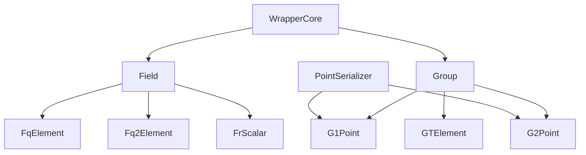

# libBLS Algebra Backends

This document explains how the algebra layer in **libBLS** is organized, the **interface that backends must comply with** and **how to add a new backend**. The goal is to keep higher‑level modules (BLS, DKG, Threshold Encryption) **backend‑agnostic** while allowing a concrete library to provide the actual elliptic curve math.

---

## 1. Folder Structure

```
backends/
│
├─ interface/                    # Backend‑agnostic wrappers and contracts
│  ├─ field/
│  │  ├─ Field.hpp               # Base interface for field elements
│  │  ├─ FqElement.hpp           # Base field element wrapper
│  │  ├─ Fq2Element.hpp          # Quadratic extension field wrapper
│  │  └─ FrScalar.hpp            # Scalar field wrapper
│  │
│  ├─ group/
│  │  ├─ Group.hpp               # Base interface for group elements
│  │  ├─ G1Point.hpp             # G1 wrapper
│  │  ├─ G2Point.hpp             # G2 wrapper
│  │  └─ GTElement.hpp           # Pairing target group wrapper
│  │
│  ├─ PointSerializer.hpp        # Deterministic point iteration and serde helpers
│  ├─ Functions.hpp              # High‑level algebra functions (pairing, Lagrange)
│  ├─ init.hpp                   # Curve initialization entry point
│  └─ WrapperCore.hpp            # Shared wrapper utilities
│
├─ mcl/                          # Concrete backend implementation: mcl
│  ├─ field/ {FqElement.cpp, Fq2Element.cpp, FrScalar.cpp}
│  ├─ group/ {G1Point.cpp, G2Point.cpp, GTElement.cpp}
|  ...
...
```

---

## 2. Design Overview



<br>

* **Wrappers in `interface/`**

  * Define the canonical API used by higher‑level modules.
  * Types: `FqElement`, `Fq2Element`, `FrScalar`, `G1Point`, `G2Point`, `GTElement`.
  * Provide common operations, serialization, and `validate()` (on‑curve and subgroup checks).
  * `PointSerializer` ensures deterministic point traversal and encoding.

* **Concrete backend (`mcl/`)**

  * Implement the wrapper interfaces for a specific library.
  * Provide optimized pairing and interpolation in `Functions.cpp`.
  * Initialize curve parameters in `init.cpp`.

* **Backend selection**

  * The current build supports MCL and selects it with `-DUSE_MCL=ON` (the
    default). The build fails when another backend is requested.
  * A future backend should preserve the interface contract and mirror the
    structure above.

---

## 3. Serialization and Deserialization Rules

> **Scope:** This section defines the **wire formats** (bytes and strings) for field elements and elliptic-curve points used by libBLS backends. **No GMP/mpz intermediate** is allowed; **each backend MUST implement serde natively**.
> **Curves:** BN254/alt\_bn128 (implicit). If another curve is used, the same rules apply but sizes may differ (extend this spec accordingly).

<br/>

### 3.1 Types & Canonical Sizes

| Type                 | Symbolic components | Bytes per component | Total bytes | String (hex) length | String (dec) format                    |
| -------------------- | ------------------- | ------------------: | ----------: | ------------------: | -------------------------------------- |
| Field element in Fr  | `a`                 |                  32 |      **32** |    **64** hex chars | single unsigned integer                |
| Field element in Fq  | `x`                 |                  32 |      **32** |    **64** hex chars | single unsigned integer                |
| G1 (affine)          | `(x, y)`            |                  32 |      **64** |   **128** hex chars | `x:y` (two unsigned decimals)          |
| G2 (affine over Fq²) | `((x₀,x₁),(y₀,y₁))` |                  32 |     **128** |   **256** hex chars | `x0:x1:y0:y1` (four unsigned decimals) |

**Notes**

* **Uncompressed only.** No compressed/flag bits in this spec.
* A **byte** is 8 bits. All integers are **non-negative** representatives in their respective finite fields.

<br/>

### 3.2 Byte Format (Binary)

#### 3.2.1 Endianness

* **Big-endian per component.** The most significant byte (MSB) of each field element comes first.
* Multi-component types are **plain concatenations** of big-endian components, in the order below.

#### 3.2.2 Component Order

* **Fr/Fq:** single 32-byte component.
* **G1:** `x || y`.
* **G2:** `x0 || x1 || y0 || y1`
  where `x = x0 + x1·i`, `y = y0 + y1·i`, and each `xi`, `yi` is a 32-byte Fq element.

#### 3.2.3 Lengths (MUST be exact)

* Fr/Fq: **32 bytes**
* G1: **64 bytes**
* G2: **128 bytes**

**Deserialization Requirements**

* Input length MUST match exactly.
* Each component MUST be interpreted as an unsigned big-endian integer **< p** (the field modulus).

<br/>

### 3.3 String Formats

Two textual encodings are supported: **hexadecimal** and **decimal**. No whitespace allowed. No prefixes (`0x`, `+`) allowed.

#### 3.3.1 Hexadecimal (preferred for bytes parity)

* **Alphabet:** `[0-9a-fA-F]` (case-insensitive). Producers SHOULD use lowercase.
* **Length MUST be exact** (no separators):

  * Fr/Fq: **64** hex chars
  * G1: **128** hex chars (`x` then `y`)
  * G2: **256** hex chars (`x0`, `x1`, `y0`, `y1`), concatenated in order
* **Endianness:** Big-endian per component (first two hex chars are the MSB of the first component).

**Deserialization**

* Reject if length is not exact or contains invalid chars.
* Parse as big-endian components; apply the same validity checks as in §2.3.

#### 3.3.2 Decimal (human-readable)

* **Alphabet:** `[0-9]` only. No leading `+`; no leading zeros except the literal `"0"`.
* **Component separator:** colon `":"` (ASCII 0x3A). No spaces.

**Forms**

* **Fr/Fq:** `a`
* **G1 (affine):** `x:y`
* **G2 (affine):** `x0:x1:y0:y1`

**Deserialization**

* Split on `":"` and expect exactly the required arity (1/2/4).
* Each part MUST be a valid base-10 integer in `[0, p-1]`.
* Reconstruct components and apply point validity checks as in §2.3.

<br/>

### 3.4 Serialization Requirements

* **No GMP/mpz by default.** Implement serde directly using backend primitives such as `mcl::Vint`. If a backend uses GMP, it must link it.
* **Big-endian conversion:** When exporting either to bytes or string, produce fixed-width big-endian per component with **left-zero padding** to 32 bytes. When importing, accept only 32-byte components.
* **Normalization:** For points, **normalize to affine** before serialization; for fields, reduce modulo `p` internally as needed.
* **Determinism:** Given the same element/point, serialization MUST be deterministic.

<br/>

### 3.5 Deserialization Requirements

* Enforce **exact lengths** and **character sets** for both binary and string encodings.
* Reject any input that violates the above with a clear error code.

---

# 4. Validation Contract

* Wrappers expose `validate()` for points and field elements.
* `validate()` performs the standard checks in a single call.
* When constructing points from raw coordinates, the caller must call `validate()` before use.

---

## 5. Adding a New Backend

1. **Add** the backend dependency to `deps/build.sh`, with commands for both
  native and Emscripten builds. For Emscripten/WASM, disable native CPU
  features and assembly paths so the build remains portable.

2. **Create a folder** under `backends/` (for example `newlib/`).
3. **Implement field wrappers** in `field/`:

   * `FqElement.cpp`, `Fq2Element.cpp`, `FrScalar.cpp`.
   * Provide arithmetic, comparison, serde (use defaults if needed), and conversions.
4. **Implement group wrappers** in `group/`:

   * `G1Point.cpp`, `G2Point.cpp`, `GTElement.cpp`.
   * Provide arithmetic, subgroup checks, hashing to curve if required by the library, and serde.
5. **Add algebra functions** in `Functions.cpp`:

   * Pairing, exponentiation, Lagrange interpolation, and other shared helpers.
6. **Initialize the curve** in `init.cpp`.
7. **Expose concrete types** by aliasing them in `interface/init.hpp`.
8. **Wire up CMake** in `backends/CMakeLists.txt`. Add your backend to the
   selection block, set its backend library list and compile definitions, and
   keep the source layout consumed by `BACKEND_SPECIFIC_SOURCES` consistent
   with the existing MCL backend.
9. **Run the backend test** (`test/unit_tests_backend.cpp`) to ensure the new backend complies with the correct serialization / deserialization format. Run also all other unit tests to test end-to-end.
